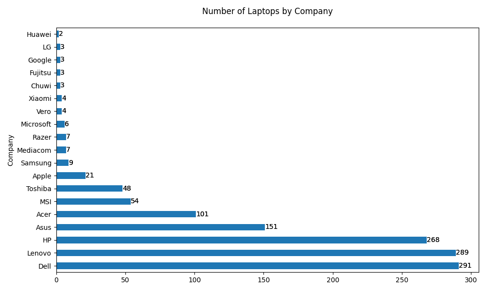
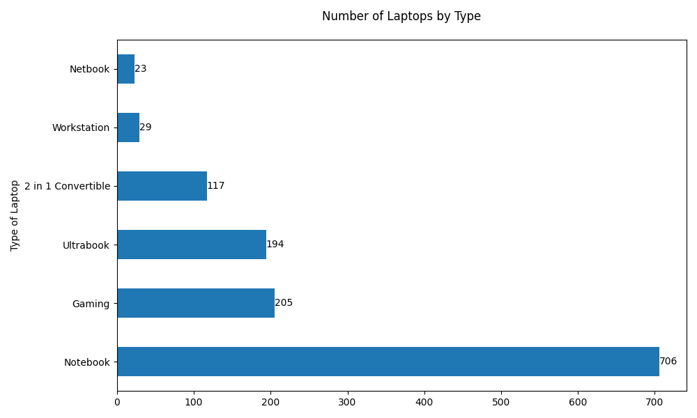

## Raw Dataset

Data columns (total 11 columns):
| Column           | Non-Null Count | Dtype   |
|-----------------|----------------|---------|
| Company         | 1303 non-null  | object  |
| TypeName        | 1303 non-null  | object  |
| Inches          | 1303 non-null  | float64 |
| ScreenResolution| 1303 non-null  | object  |
| Cpu             | 1303 non-null  | object  |
| Ram             | 1303 non-null  | object  |
| Memory          | 1303 non-null  | object  |
| Gpu             | 1303 non-null  | object  |
| OpSys           | 1303 non-null  | object  |
| Weight          | 1303 non-null  | object  |
| Price           | 1303 non-null  | float64 |

- There were 29 duplicated entries. So dropped them.
- Removed 'GB' from values of `Ram` column and changed it to `int32` dtype.
- Removed 'kg' from values of `Weight` column and changed it to `float32` dtype.
- Rounded off the prices from `Price` column and changed it to `int64` dtype.


## Exploratory Data Analysis (EDA)

- The distribution of laptop prices shows a right-skewed pattern, indicating a higher frequency of lower-priced laptops compared to premium/expensive models.

- Distribution of laptops by manufacturer:

    

- Our datasets have the following brand's laptops the most:
    - Dell (291)
    - Lenovo (289)
    - HP (268)
    - Asus (151)
    - Acer (101)

- Distribution of laptops by type:

    

- The most laptops have type: Notebook (706), Gaming (205), and Ultrabook (194)

- Merged 'Windows 10 S' into 'Windows 10' in `OpSys` column.

- Renamed 'Mac OS X' to 'macOS X' in `OpSys` column.

- Removed Android type laptops for having very less data.

- Laptops by CPU Brands:
    - Intel: 1211
    - Others: 61 (After removing "_ARM Mali T860 MP4_", it became 60)

- Laptops by GPU Brands:
    - Intel: 701
    - Nvidia: 396
    - AMD: 174
    - One was "_ARM Mali T860 MP4_" but removed since it is Mobile GPU and not suited for standard laptops.


## Feature Engineering

- Created `HasIpsPanel` and `HasTouchScreen` features from `ScreenResolution` column.

- Created `ResWidth` and `ResHeight` columns from `ScreenResolution`

- Created `ResCategory` column such that:
    - if width * height <= 1366 * 768 then `Low`
    - if width * height <= 1920 * 1080 then `Mid`
    - if width * height <= 2560 * 1600 then `High`
    - if any higher than that then `Ultra`

- Created `Ppi` column using the following formula:
    ```python
    Ppi = (width**2 + height**2)**0.5 / inches
    ```

- Dropped `ScreenResolution` column.

- Created `CpuCategory` column. It has following values:
    ```
    CpuCategory
    Intel Core i7    515
    Intel Core i5    423
    Other Intel      139
    Intel Core i3    134
    AMD A9            15
    AMD A6            11
    AMD E-Series       9
    AMD A12            8
    AMD A10            6
    AMD Ryzen          4
    AMD A8             4
    AMD FX             2
    AMD A4             1
    Samsung            1
    ```

- Created `CpuSpeedGhz` column. It has continuous float data.

- Dropped `Cpu` column as all relevant information was retrieved.

- Created `GpuCategory` column from the information retrieved from `Gpu` column.
- The values of `GpuCategory` column are by following criteria:

    | GPU Category        | Included GPUs / Keywords                                                                 |
    |---------------------|-------------------------------------------------------------------------------------------|
    | **Intel High-End**  | iris                                                                                      |
    | **Intel Mid-End**   | uhd                                                                                       |
    | **Intel Low-End**   | hd                                                                                        |
    | **Intel Other**     | Any other Intel GPU not matching above                                                   |
    | **Nvidia High-End** | gtx1080, gtx1070, gtx1060, gtx1050ti, gtx1050, gtx980, gtx970, gtx960                     |
    | **Nvidia Mid-Range**| gtx950, mx150, 150mx, mx130, 940mx, 930mx, 960m, 965m, gtx940m, gtx940mx                   |
    | **Nvidia Low-End**  | 920mx, 920m, 930m, 940m, 920                                                               |
    | **Nvidia Quadro**   | quadro                                                                                    |
    | **Nvidia Other**    | Any other Nvidia GPU not matching above                                                  |
    | **AMD High-End**    | rx580, rx560, rx550, rx540, pro560, pro555, pro455, r9, m385                              |
    | **AMD Mid-End**     | radeon540, radeon530, radeon520, r7m445, r7m440, r7m460, r7m365x                          |
    | **AMD Low-End**     | r5m330, r5m430, r5m420, r5m315, r5520, r5430, radeonr3, radeonr2, r5, r7, r4graphics,     |
    |                     | r2graphics, radeonr4, radeonr7                                                            |
    | **AMD Firepro**     | firepro                                                                                   |
    | **AMD Other**       | Any other AMD GPU not matching above                                                     |
    | **Unknown**         | Any GPU not containing intel, nvidia, or amd keywords                                     |

- Dropped `Gpu` column as relevant information was retrieved.


## Categorical Columns

1. Column Name: Company

    - Unique Values: ['Apple' 'HP' 'Acer' 'Asus' 'Dell' 'Lenovo' 'Chuwi' 'MSI' 'Microsoft'
    'Toshiba' 'Huawei' 'Xiaomi' 'Vero' 'Razer' 'Mediacom' 'Samsung' 'Google'
    'Fujitsu' 'LG']
    - Number of Unique Values: 19
    - Missing Values: 0

------------------------------

2. Column Name: TypeName

    - Unique Values: ['Ultrabook' 'Notebook' 'Netbook' 'Gaming' '2 in 1 Convertible'
    'Workstation']
    - Number of Unique Values: 6
    - Missing Values: 0

------------------------------

3. Column Name: OpSys

    - Unique Values: ['macOS' 'No OS' 'Windows 10' 'macOS X' 'Linux' 'Chrome OS' 'Windows 7']
    - Number of Unique Values: 7
    - Missing Values: 0

------------------------------

4. Column Name: ResCategory

    - Unique Values: ['High' 'Mid' 'Ultra' 'Low']
    - Number of Unique Values: 4
    - Missing Values: 0

------------------------------

5. Column Name: CpuCategory

    - Unique Values: ['Intel Core i5' 'Intel Core i7' 'AMD A9' 'Intel Core i3' 'Other Intel'
    'AMD E-Series' 'AMD A6' 'AMD Ryzen' 'AMD FX' 'AMD A10' 'AMD A8' 'AMD A12'
    'AMD A4']
    - Number of Unique Values: 13
    - Missing Values: 0

------------------------------

6. Column Name: GpuCategory

    - Unique Values: ['Intel High-End' 'Intel Low-End' 'AMD High-End' 'AMD Low-End'
    'Nvidia Mid-End' 'Intel Mid-End' 'Nvidia High-End' 'AMD Mid-End'
    'Nvidia Low-End' 'AMD Other' 'Nvidia Quadro' 'AMD Firepro' 'Intel Other']
    - Number of Unique Values: 13
    - Missing Values: 0

------------------------------